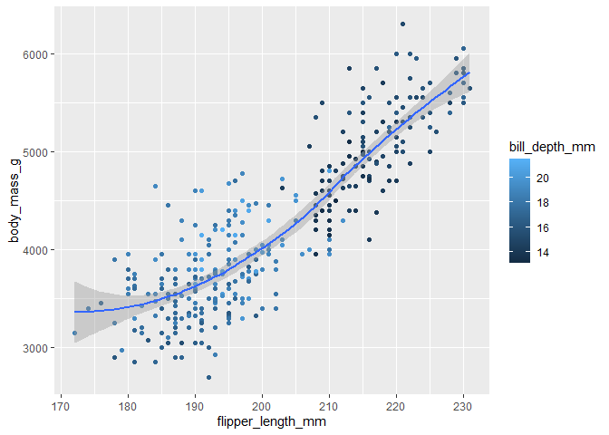

# Homework 03

# Base R and R Basics

## Creating and naming variables

------------------------------------------------------------------------

1.  Create a variable called `x` and use it to store the result of the
    calculation `(3*(4+2)`.

``` r
 x <- (3 * (4 + 2))
```

2.  Calculate the product of `x` (from the above question) times π.

``` r
print(pi)*x
```

    [1] 3.141593

    [1] 56.54867

OR

``` r
π <- 3.14159
x * π
```

    [1] 56.54862

3.  Use the `getwd()` function to show your current working directory.
    Is that a good working directory, and what program do you think set
    it that way?

``` r
getwd() 
```

    [1] "C:/Users/kayla/OneDrive/Desktop/UTK/UTK_F2023/GEOL_590/Homework/HMK_03"

No, it is not a good working directory because it is not linked to my
class folder. I think R automatically set the directory to my
“downloads” folder because I did not indicate the directory I wanted it
to follow. I reset the directory to my class folder using the setwd()
function.

I changed the working directory manually through session -\> set working
directory -\> choose path

## Vectors

------------------------------------------------------------------------

1.  Use the `c()` function to create a vector of numbers.

``` r
c(1.1, 2.2, 3.3, 4.4, 5.5)
```

    [1] 1.1 2.2 3.3 4.4 5.5

2.  Use the `c()` function to create a vector of characters.

``` r
c("one", "two", "three")
```

    [1] "one"   "two"   "three"

3.  Use the `:` implicit function to create a vector of integers from 1
    to 10.

``` r
1:10 
```

     [1]  1  2  3  4  5  6  7  8  9 10

OR

``` r
c(1:10)
```

     [1]  1  2  3  4  5  6  7  8  9 10

4.  Explain *why* the following code returns what it does. Also address
    whether you think this was a good decision on the part of the
    designers of R?

``` r
v1 <- 1:3
v2 <- c(1:4)
v1 + v2
```

    [1] 2 4 6 5

{r, warning=FALSE} ensures that warnings are suppressed in R markdown
output

v1 is an implicit function and 1:3 means a string of 1, 2, 3

v2 is also a string of numbers, so c(1:4) is 1, 2, 3, 4. c() is the
concatenate function and gives parameters inside the function.

v1 + v2 adds the numbers of the vectors together and yields four numbers
in a vector ” 2 4 6 5”

The code returns the message: “longer object length is not a multiple of
shorter object length,” which occurs when you are performing a function
on vectors, and the vectors are not the same length. R responds by
adding the last value of v4 is added to the first number of v3 because
the vector wraps. Although it is nice that R provides a warning that
something could be wonky, it could still easily become confusing to the
user. It would make more sense for the code to only run vectors of the
same lenght to avoid inaccurate data that could easily be missed.

5.  Explain what the following code does. It may be helpful to reference
    the answer to the previous question:

The code takes each individual number in the parentheses and distributes
to add 3 to each number in the vector. This is a clear way of adding
values because there is only one number to be added to each number,
compared to using two vectors like the previous question.

``` r
c(1, 5, 9) + 3
```

    [1]  4  8 12

6.  Remove (delete) every variable in your workspace.

``` r
rm(list=ls())
```

rm removes what is listed in the function, list allows the names to be
added to the function and ls() includes variables/objects in the
workspace, which tells R to remove everything under ls().

## Graphics

------------------------------------------------------------------------

1.  Load the tidyverse package. **NOTE:** Be sure to use the chunk
    option `message=FALSE` to suppress the messages that tidyverse
    prints when loaded. These messages are useful in the

``` r
message=FALSE

library(tidyverse)
```

2.  Recreate the visualization of `body_mass_g` to `flipper_length_mm`,
    from the penguins data set, that is shown in question 8 of section
    2.2.5 of [R4DS](https://r4ds.hadley.nz/data-visualize).

``` r
#Load the libraries of data and ggplot for graphing
    library(palmerpenguins)
    library(ggthemes)
    library(ggplot2)

#Recreate final graph 
    ggplot(
  data = penguins, # dataset
  mapping = aes(x = flipper_length_mm, y = body_mass_g)) + # x and y axis information and labels
  geom_point(aes(color = bill_depth_mm)) + # scatter plot information
  geom_smooth() # line showing how these points and other info correlate
```



4.  Explain why each aesthetic is mapped at the level that it is (i.e.,
    at the global level, in the `ggplot()` function call, or at the geom
    level, in the `geom_XXX()` function call). Note: A lot of different
    options will work, but some options are clearly better than others.

global level - sets the background basis of the map and that’s passed
down and all other layers are set on top of that

geom tells it what kind of plot you’re trying to make, it allows your to
use aesthetics to further differentiate different data points.
