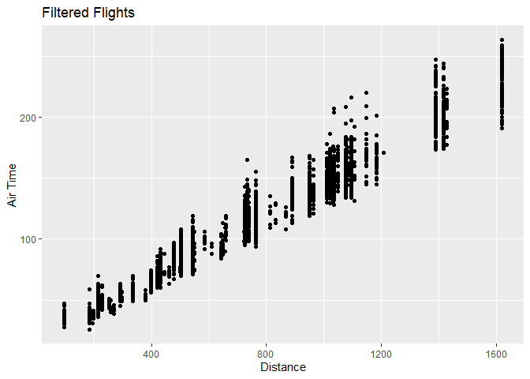
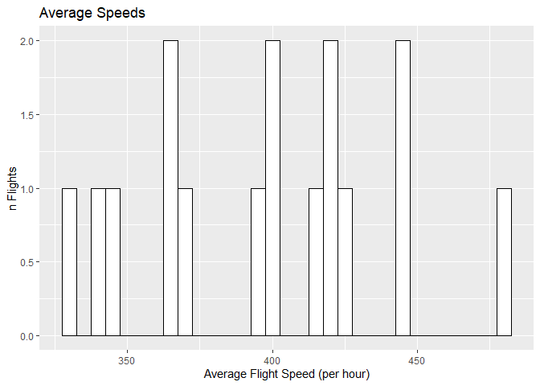

# Hmk_04 template: Data frames and data wrangling

# Homework 04

------------------------------------------------------------------------

## Installing data packages

``` r
library(nycflights13)
library(dplyr)
library(tidyverse)
```

# Question 1: filtering

Make a plot of air time as a function of distance (air time on the y
axis, distance on the x axis) for all flights that meet the following
criteria:

- originate from LaGuardia airport (“LGA”)
- departed on the 16th of the month
- have a flight distance of less than 2000

``` r
flights |>
  filter(origin =="LGA", 
         day == "16", 
         distance <2000) %>%
  ggplot(mapping = aes(x = distance, y = air_time)) +
  geom_point(na.rm = TRUE) + 
  labs(title = "Filtered Flights", 
       x = "Distance", 
       y = "Air Time")
```



# Question 2: dealing with NAs

Make a data frame of all of the rows of `flights` that have values for
*both* `arr_time` and `dep_time` - that is, neither of those values are
`NA`.

## filtering NAs

`ggplot()` will automatically remove NA values from the plot, as you may
have seen in question 1, but it emits a warning message about that. Of
course you could silence the warning message using [chunk
options](https://bookdown.org/yihui/rmarkdown-cookbook/chunk-options.html),
but how could you prevent them from appearing in the first place?

*To prevent NA values from appearing in a plot from the beginning, you
can use a couple functions to exclude them from the data in the first
place. For example: the na.omit() function or !is.na when filtering,
like below:*

``` r
flights |>
  filter(!is.na(arr_time), 
  !is.na(dep_time)) 
```

    # A tibble: 328,063 × 19
        year month   day dep_time sched_dep_time dep_delay arr_time sched_arr_time
       <int> <int> <int>    <int>          <int>     <dbl>    <int>          <int>
     1  2013     1     1      517            515         2      830            819
     2  2013     1     1      533            529         4      850            830
     3  2013     1     1      542            540         2      923            850
     4  2013     1     1      544            545        -1     1004           1022
     5  2013     1     1      554            600        -6      812            837
     6  2013     1     1      554            558        -4      740            728
     7  2013     1     1      555            600        -5      913            854
     8  2013     1     1      557            600        -3      709            723
     9  2013     1     1      557            600        -3      838            846
    10  2013     1     1      558            600        -2      753            745
    # ℹ 328,053 more rows
    # ℹ 11 more variables: arr_delay <dbl>, carrier <chr>, flight <int>,
    #   tailnum <chr>, origin <chr>, dest <chr>, air_time <dbl>, distance <dbl>,
    #   hour <dbl>, minute <dbl>, time_hour <dttm>

# Question 3: adding columns

Create a data frame of average flight speeds, based on `air_time` and
`distance`. Make either a histogram or a density plot of the data. If
you like, you may break the data out (e.g. by airline, or some other
variable) in a way that you think makes sense.

``` r
avg.speeds <- flights |>
  mutate(speed = distance/(air_time/60)) |>
  group_by(carrier) |>
  summarise(avg.speeds = mean(speed, na.rm = TRUE))

avg.speeds |> 
  ggplot(mapping = aes(x = avg.speeds)) + 
  geom_histogram(binwidth = 5, 
                 na.rm = TRUE, color="black", fill="white") + 
  labs(title = "Average Speeds", 
       x = "Average Flight Speed (per hour)", 
       y = "n Flights")
```


