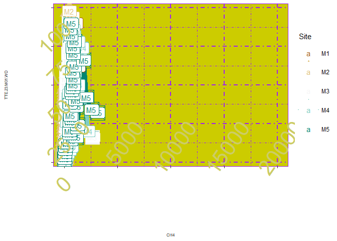
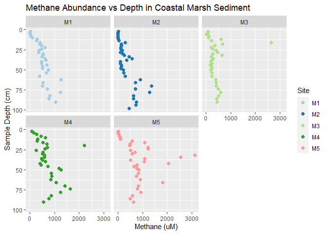

# HMK07

## HMK07

# Bad Plot

``` r
library(tidyverse)
library(ggplot2)


Marsh <- read_csv("Marsh.csv")

Marsh |> ggplot(mapping = aes(x =`CH4 (uM)`, y=`Sample ID`, shape= Site, color=Site)) +
  geom_point(size = 10) + 
  xlim(-50, 20000) +
  geom_line(size=3)+
  scale_color_brewer(palette = "BrBG")+
  theme(axis.text.x = element_text(size = 32, color = "#cccc66", angle = 55, vjust = 2, hjust=1)) +
  theme(axis.text.y = element_text(size = 32, color = "#cccc66", angle = 45, vjust = 2, hjust=1)) + theme(axis.text=element_text(size=4),  axis.title=element_text(size=6))+
  theme(panel.grid = element_line(color = "purple", size = 1,linetype = 4)) +theme(panel.background = element_rect(fill = "#CCCC00", color = "purple"))+
  geom_label(aes(label = Site)) +
  labs(x = "CH4", y = "TTE.23.M01.WD") 
```



# Why this plot is bad:

- Tufte would not appreciate the “data-to-ink ratio” because it makes it
  “harder to interpret.” Excess embellishments include the background
  fill, unnecessary lines, and unhelpful grids.
- According to Wilke, “if a figure has problems with perception; it may
  be unclear, confusing, overly complicated, or deceiving.” This graph
  is certainly unclear and confusing.
- Healy has a section about the importance of color and color contrast.
  The axis labels of this graph have no contrast with the graph’s
  background color. It is nearly impossible to read because the yellow
  hues are so similar. It might be helpful if the axis labels weren’t
  unnecessarily angled toward the graph.
- The purpose of this plot is to compare how methane emissions differ
  through a 1 meter soil cores in 5 different sites. The way the graph
  is set up, the different sites are not discernible, so it is
  impossible to compare them.

# A better version:

``` r
Marsh |> ggplot(mapping = aes(x = `CH4 (uM)`, y = `Sample ID`, color=Site)) +
  geom_point(size = 2) +
  scale_color_brewer(palette = "Paired") +
  labs(title = "Methane Abundance vs Depth in Coastal Marsh Sediment", x = "Methane (uM)", y = "Sample Depth (cm)") +
  facet_wrap(~Site)+
  scale_y_reverse() 
```


