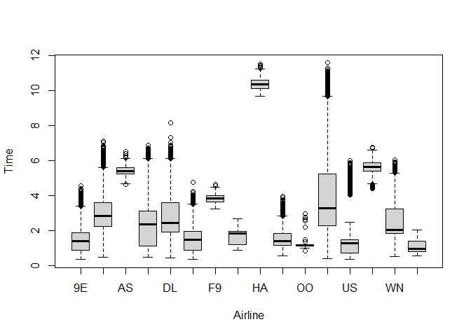

# Mid-semester check-in: Part I

1.  Calculate the average and standard deviation of flight delays for
    each airline, *counting only those flights that were delayed longer
    than an hour*.

``` r
library(tidyverse)
library(nycflights13)

View(flights)

flightstats <- flights |> 
  filter(arr_delay> 60, na.rm = TRUE)  |>
  group_by(carrier) |>
  summarise(mean.delay = mean(arr_delay), st.dely = sd(arr_delay))
```

2.  Identify the 5 flights (i.e., unique combination of `carrier` and
    `flight`) that are most frequently delayed more than a half hour.

``` r
topdelay <- flights |>
  filter(dep_delay >= 30, arr_delay >= 30)|>
  count(carrier, flight, sort = TRUE) |>
  head(5) 
```

3.  Make a plot of the distribution of flight times for each airline.
    The plot should show summary statistics in some way (e.g. median,
    upper and lower quartiles; you can choose which summary statistics
    are best) as well as individual data points. Order the x axis in
    order of median flight time, from highest on the left to lowest on
    the right.

``` r
boxplot(flights$air_time/60 ~ flights$carrier, data =  flights, xlab= "Airline", ylab = "Time")
```


